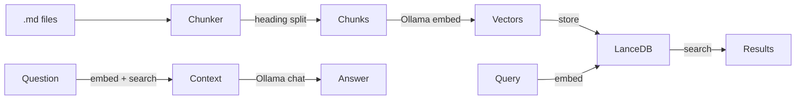

# rag

**rag** is a CLI tool and MCP server that turns markdown documentation into a searchable, queryable knowledge base.

It chunks .md files by heading, embeds them via Ollama, stores vectors in LanceDB, and exposes search + RAG through both a terminal CLI and MCP.

---

## Prerequisites

- [Bun](https://bun.sh) runtime
- [Ollama](https://ollama.com) running locally with embedding model (auto-pulled if missing)

## Install

```bash
git clone https://github.com/FrameMuse/llm-rag.git
cd llm-rag
bun install
```

Add shell alias:

```bash
alias rag='bun /path/to/llm-rag/scripts/cli.ts'
```

## Quick start

```bash
cd my-docs-project
rag init              # create .rag/ project scope
rag index             # chunk, embed, index all .md files
rag mcp search "..."  # semantic search
rag mcp query "..."   # RAG: synthesize answer from docs
```

## Commands

| Command | Description |
|---------|-------------|
| `rag init` | Create .rag/ config, mcp.json, .gitignore |
| `rag index` | Chunk files by heading, embed via Ollama, store in LanceDB |
| `rag serve` | Start MCP server (STDIO) for current .rag/ scope |
| `rag mcp <tool>` | One-shot CLI proxy for MCP tools |
| `rag info` | Show index statistics |
| `rag help` | Show usage |

### rag mcp tools

| Tool | Usage | Description |
|------|-------|-------------|
| `search` | `rag mcp search "query" [--limit N]` | Semantic vector search |
| `query` | `rag mcp query "question"` | RAG: retrieve chunks, synthesize answer |
| `list-documents` | `rag mcp list-documents` | List all indexed files |
| `get-document` | `rag mcp get-document <path>` | Show full document content |
| `config` | `rag mcp config` | Print mcp.json for opencode.json adoption |

## Project scope (.rag/)

```
project/
├── .rag/
│   ├── config.json       # { name, embedModel, ragModel, pattern }
│   ├── mcp.json          # MCP config snippet for opencode.json
│   ├── .gitignore        # *
│   └── data/lancedb/     # Vector index (generated by rag index)
├── *.md
└── ...
```

Each project keeps its index local. `rag` discovers .rag/ by walking up from current directory (like git).

## MCP integration

Register in `opencode.json`:

```json
{
  "mcp": {
    "my-docs": {
      "type": "local",
      "command": ["rag", "serve"],
      "cwd": "/path/to/project",
      "enabled": true
    }
  }
}
```

Run `rag mcp config` from project directory to print the snippet with `cwd` pre-filled.

## Architecture



- **Chunker**: splits by `##` / `###` headings, preserves heading hierarchy, merges tiny sections
- **Embedder**: Ollama `/api/embed` in batches of 20, truncates to 500 tokens per chunk
- **Store**: LanceDB embedded vector database (no external server)
- **RAG**: retrieve top 8 chunks, build context prompt, call Ollama chat for synthesis

## Configuration

`.rag/config.json`:

```json
{
  "name": "my-docs",
  "embedModel": "nomic-embed-text",
  "ragModel": "llama3.2:3b",
  "pattern": "*.md"
}
```

Models auto-pull if missing. Override via `rag init` or edit config.json directly.

## License

MIT
