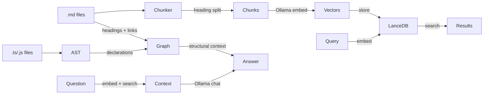

# rag

**rag** is a CLI tool and MCP server that turns codebases and documentation into a searchable, queryable knowledge base with vector search, RAG, and a structural knowledge graph.

---

## Prerequisites

- [Bun](https://bun.sh) runtime
- [Ollama](https://ollama.com) running locally with embedding model (auto-pulled if missing)

### Minimum hardware

| Component | Requirement |
|-----------|-------------|
| RAM | 4 GB (8 GB for larger doc sets) |
| CPU | Any x86-64 or ARM64, 2+ cores |
| GPU | Optional. Any NVIDIA GPU with 2+ GB VRAM. CPU-only fallback is functional but slower |
| Disk | 100 MB for index (scales with doc count) |

Indexing 5000 chunks: ~25s on RTX 3060, ~3min on CPU-only.

## Install

```bash
git clone https://github.com/FrameMuse/llm-rag.git
cd llm-rag
bun install
```

Add shell alias:

```bash
alias rag='bun /path/to/llm-rag/scripts/cli.ts'
```

## Quick start

```bash
cd my-project
rag init              # create .rag/ project scope
rag index             # chunk, embed, index all files
rag mcp search "..."  # 1. retrieve document chunks
rag mcp graph "..."   # 2. query knowledge graph
rag mcp get-document <path>  # 3. read full documents
```

Do NOT use `rag mcp query` — it uses a small local model. Orchestrate `search` + `graph` tools directly and synthesize with your own reasoning.

## Commands

| Command | Description |
|---------|-------------|
| `rag init` | Create .rag/ config, mcp.json, .gitignore |
| `rag index` | Chunk files, embed via Ollama, store in LanceDB |
| `rag serve` | Start MCP server (STDIO) for current .rag/ scope |
| `rag graph build` | Build knowledge graph from code and docs |
| `rag mcp <tool>` | One-shot CLI proxy for MCP tools |
| `rag info` | Show index statistics |

### rag mcp tools

Do NOT use `rag mcp query` or `rag mcp query --graph` — they use a small local model that produces lower quality answers. Use these tools instead:

| Tool | Usage | Description |
|------|-------|-------------|
| `search` | `rag mcp search "query" [--chunks N] [--limit N]` | Retrieve relevant document chunks |
| `graph` | `rag mcp graph "topic" [--signature] [--limit N]` | Knowledge graph query |
| `get-document` | `rag mcp get-document <path>` | Read full document content |
| `list-documents` | `rag mcp list-documents` | List all indexed files |
| `config` | `rag mcp config` | Print mcp.json for opencode.json adoption |

## Project scope (.rag/)

```
project/
├── .rag/
│   ├── config.json       # { name, embedModel, ragModel, pattern, chunks, temperature }
│   ├── mcp.json          # MCP config snippet for opencode.json
│   ├── .gitignore        # *
│   ├── data/
│   │   ├── lancedb/      # Vector index (generated by rag index)
│   │   └── graph.json    # Knowledge graph (generated by rag index)
├── *.md
├── src/
└── ...
```

Each project keeps its index and graph local. `rag` discovers .rag/ by walking up from current directory (like git).

## MCP integration

Register in `opencode.json`:

```json
{
  "mcp": {
    "my-project": {
      "type": "local",
      "command": ["rag", "serve"],
      "cwd": "/path/to/project",
      "enabled": true
    }
  }
}
```

The MCP server exposes 10 tools:

| Tool | Purpose | Best for |
|------|---------|----------|
| `search` | Vector search | Retrieving relevant chunks |
| `graph_find` | Search graph nodes | Finding code entities |
| `graph_neighbors` | Node connections | Exploring structure |
| `graph_god_refs` | Core abstractions | Architecture overview |
| `graph_path` | Shortest path | Tracing relationships |
| `graph_communities` | List communities | Module discovery |
| `list_documents` | List indexed files | Discovery |
| `get_document` | Read file content | Deep reading |
| `query_with_graph` | **NOT FOR AGENT** — uses small local model | Do not use |
| `query` | **NOT FOR AGENT** — uses small local model | Do not use |

Call `search` + `graph` tools directly and synthesize with your own reasoning.

Run `rag mcp config` from project directory to print the snippet with `cwd` pre-filled.

## Architecture



- **Vector RAG**: chunks embedded → vector search → top K → LLM synthesis
- **Knowledge graph**: TS/JS AST and MD headings/links → nodes + edges → structural queries
- **Agent-driven**: orchestrate `search` + `graph` tools yourself for best results
- **Single-call**: `query_with_graph` for fast combined answers using local synthesis

## Knowledge graph

The knowledge graph extracts structural relationships from TypeScript, JavaScript, and Markdown files:

- **TS/JS**: functions, classes, interfaces, types, enums, imports, extends, class members
- **MD**: headings, frontmatter titles, cross-document links

### Two-tier design

**Free-form** — shows everything the graph knows about a topic in one report:

```bash
rag mcp graph "render"
→ Matching references + top match detail + connections + community + god rank + surprises
```

**Subcommands** — focused queries when you know what you need:

| Subcommand | Description |
|------------|-------------|
| `rag mcp graph god-refs [--limit N]` | Most connected core abstractions |
| `rag mcp graph communities` | List all directory-based communities |
| `rag mcp graph community <id>` | Show all references in a community |
| `rag mcp graph surprises [--limit N]` | Cross-community surprising connections |
| `rag mcp graph cycles` | Detect circular imports |
| `rag mcp graph neighbors <node>` | Connections for a node |
| `rag mcp graph path <from> <to>` | Shortest path between two nodes |
| `rag mcp graph list` | Reference and edge counts |

**Flags:**
- `--signature` — show declaration signatures (e.g., `function render(ctx: CanvasCtx): void`)
- `--limit N` — max results to show (default 10)
- `--dir in|out|both` — direction for neighbors (default both)
- `--type <edgeType>` — filter edges by type

Built automatically at the end of each `rag index`. Incrementally updated during `--watch` mode.

## Vision (image captioning)

Images are captioned via qwen3-vl during index phase 2 (text first, then images in parallel with 4 workers). The caption text is embedded and stored alongside text chunks, making images searchable by description.

Supported: `.png .jpg .jpeg .gif .webp .svg` (SVG via sharp).

Requires `qwen3-vl` pulled in Ollama.

## Configuration

`.rag/config.json`:

```json
{
  "name": "my-project",
  "embedModel": "mxbai-embed-large",
  "ragModel": "llama3.2:3b",
  "visionModel": "qwen3-vl",
  "pattern": "",
  "chunks": 8,
  "temperature": 0.3
}
```

Models auto-pull if missing. `--chunks` overrides per query.

## License

MIT
